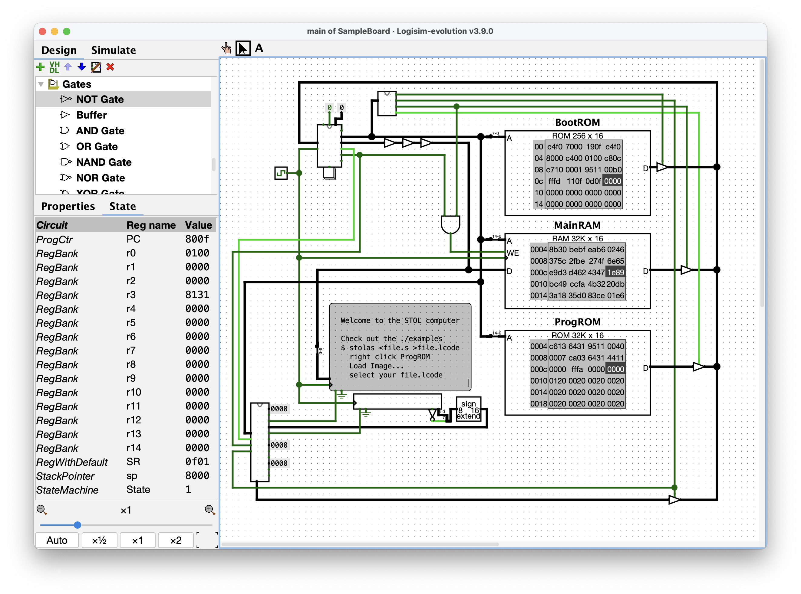

# The STOL Architecture

## Contents
* [Running Programs](#running-programs)
* [Writing Programs](#writing-programs)
* [License](#license)

## Running Programs
The CPU reference implementation is a circuit file
for [Logisim Evolution][LE] (tested on versions 3.3.0 and 3.9.0).
This, in turn, requires a [Java runtime environment][JRE].
Java 21 or newer is required to run version 3.9.0,
but older versions have looser requirements.

The bare CPU is available inside the `libraries` directory,
but you probably want to begin with the `SampleBoard.circ`,
representing a complete system with attached memory
and simple I/O devices.
This circuit file is preloaded with a welcome program;
click the reset button attached to the bottom of the CPU
with the Poke Tool (the hand) and start the system clock
with “Simulate > Auto-Tick Enabled”.

The `examples` directory contains a selection of sample programs.
Each `file.s` is the source to an associated `file.lcode`.
To load and run a program:

* Stop the system clock (Simulate > Auto-Tick Enabled: disable)
* Right click on the ProgROM component
* Select “Load Image...”
* Navigate to and open the desired `file.lcode`
* Press the reset button beneath the CPU
* Start the system clock (Simulate > Auto-Tick Enabled: enable)

## Writing Programs
Consult the `documentation.pdf` for a complete reference
on programming in assembly language for this system.
The following assumes a Unix-like environment,
such as macOS, FreeBSD, Solaris, Linux, or WSL for Windows.
To assemble a program, build the `stolas` assembler
and execute it as a filter on your source file:

    $ stolas <file.s >file.lcode

In order to build `stolas`, you need:

* `lex` (perhaps from `flex`), a standard lexer generator
* `yacc` (perhaps from `bison`), a standard parser generator
* a C compiler, targeting C99 or later
* `make`, be that GNU make or BSD make

With all tools available, run `make` in the `tools` directory
and you should find `stolas` in that directory.

    $ cd tools && make

## License
The package as a whole and all files included herein
are licensed under the terms of the MIT license; see `LICENSE`.
The files `documentation.tex` and `documentation.pdf`
are additionally licensed under
[Creative Commons Attribution 4.0 International][CCBY];
see `LICENSE.DOCUMENTATION`.
You may use the two aforementioned documentation files
under your choice of either of these two licenses.

[JRE]: https://adoptium.net/temurin/releases/
[LE]: https://github.com/logisim-evolution/logisim-evolution/releases
[CCBY]: https://creativecommons.org/licenses/by/4.0
